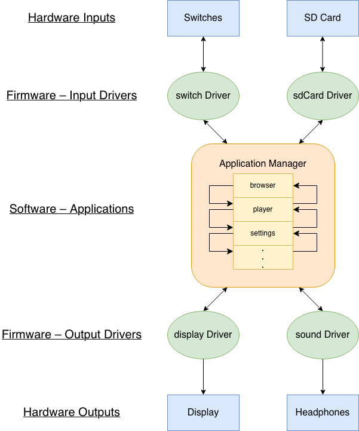

# Custom ESP32 Digital Audio Player

An open hardware and software project to build a custom music player
and library management system. Store music on an SD card, and listen
to it through wired headphones and speakers, or via Bluetooth [TODO].

## Highlights
- Responsive user interface
- Support for lossy and lossless music files
- Interactive local music library viewer
- Web-based library management software [TODO]
- [Project blog](https://arrathore.github.io/projects/music-player/music-player.html)

## Overview
The embedded software on the ESP32 works primarily by exposing an
application framework that can be used to build various
functionalities. By defining certain, predefined behaviors, we can
expand easily upon existing code to write new applications. So far,
the applications include:
- Browser > Browse files stored on the SD card
- AlbumView > Interact with formatted albums
- NowPlaying > View current player info and use traditional media controls

There are also drivers exposed for hardware interaction with the
display, SD card, and audio hardware.

## Future Expansions
- Full Bluetooth support
- Web-based library management

